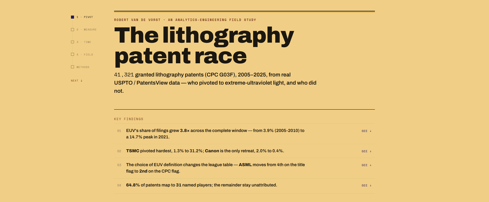
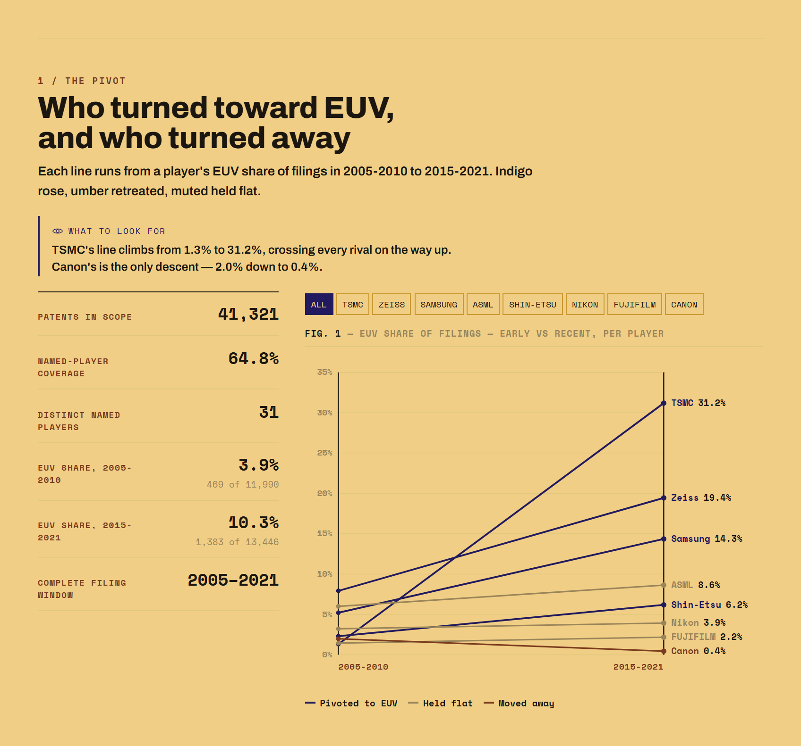
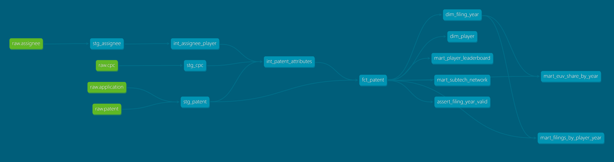
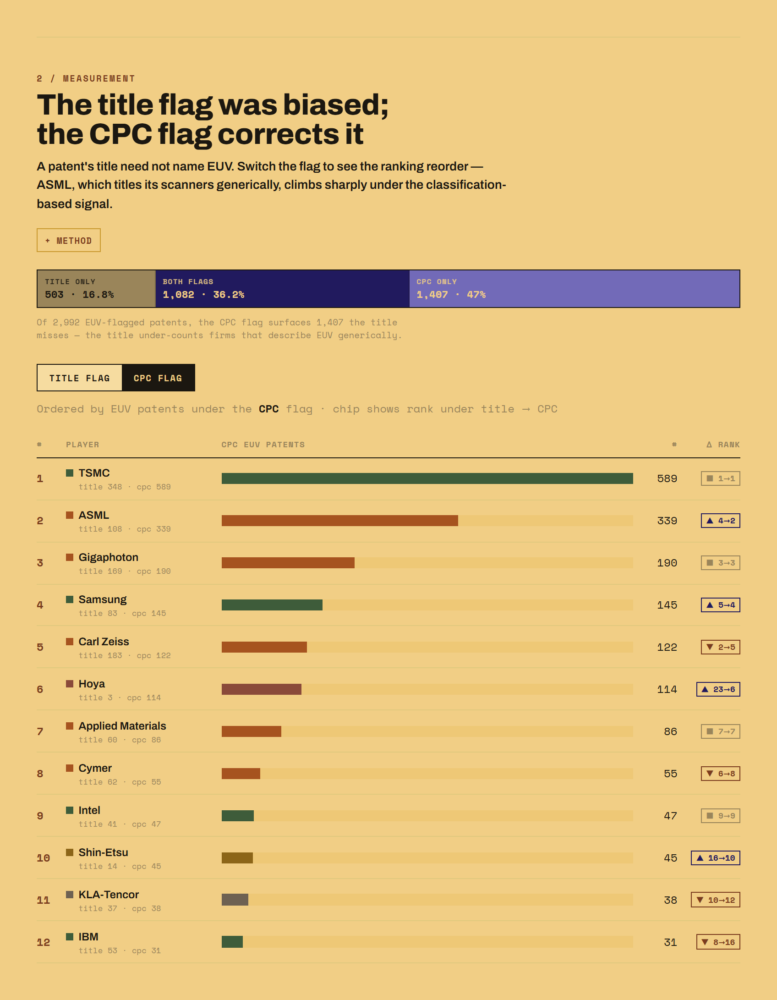
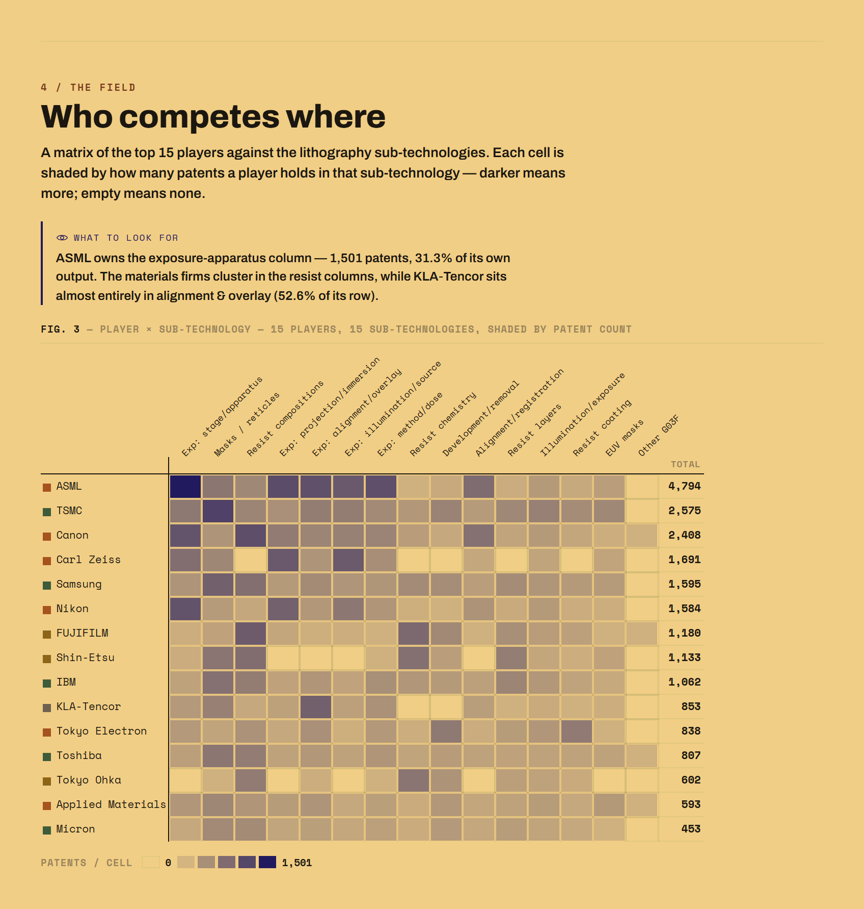

# The lithography patent race

Two decades of the semiconductor **lithography** patent race, reconstructed from real
USPTO / PatentsView data: **41,321** granted patents in CPC subclass **`G03F`**
(microlithography), 2005–2025 — asking *who actually pivoted to extreme-ultraviolet (EUV),
and who did not.*

**Live demo → https://litho-patent-race.vercel.app/**



An analytics-engineering portfolio piece: **PatentsView TSVs → DuckDB → dbt → JSON →
React + D3**. The interesting parts are the *engineering decisions* — scope-filtering 5.7 GB
at load time, a tested dbt model, assignee normalisation, and a measurement-validity problem
that overturned the starting hypothesis. Those are the middle of this document; the findings
are the top.

---

## The question

Every chip is printed by projecting circuit patterns onto silicon with light. The race to
shorter wavelengths — from deep-ultraviolet (DUV) to **EUV at 13.5 nm** — is one of the
defining contests in modern manufacturing, and it is almost entirely legible in the patent
record. CPC subclass **`G03F`** is exactly "photomechanical production of textured surfaces,
e.g. for lithography" — a clean, self-contained slice of the patent system that maps to this
one industry.

The starting hypothesis was simple: **ASML, the company that builds every EUV scanner on
Earth, should show a clear pivot in its patent composition from DUV to EUV.** The data said
otherwise — which is where the project got interesting.

---

## Key findings

- **EUV's share of filings grew ~3.8×** across the analytically complete window — from
  **3.9%** of filings in 2005–2010 (469 of 11,990) to **10.3%** in 2015–2021 (1,383 of
  13,446), peaking at **14.7%** in 2021.
- **The pivot was concentrated, not universal.** **TSMC** pivoted hardest — EUV rose from
  **1.3% → 31.2%** of its filings. **Carl Zeiss** (7.9% → 19.4%) and **Samsung**
  (5.2% → 14.3%) also turned. **Canon** is the only retreat: **2.0% → 0.4%**.
- **ASML looks flat — 6.0% → 8.6%** — because it titles its scanners generically
  ("lithographic apparatus"), not "EUV". This is a *measurement* artefact, and correcting it
  is the core of the project (below).
- **64.8% of the 41,321 patents map to 31 canonical players**; the rest are a long tail of
  minor assignees left as `Other` rather than silently dropped.



---

## The stack & pipeline

```
PatentsView TSVs   →   DuckDB              →   dbt                    →   JSON          →   React + D3
~5.7 GB, 4 tables      scope-filter to         staging → intermediate     7 static marts    editorial SPA
                       41,321 G03F patents     → marts                     in public/data/   (D3 = maths,
                       AT LOAD TIME            12 models · 21 tests                           React renders SVG)
```

- **PatentsView bulk TSVs** — the authoritative *disambiguated* USPTO grant data (assignees
  and inventors resolved across name variants), free to bulk-download.
- **DuckDB** — an in-process OLAP engine that reads TSV directly and filters ~5.7 GB down to
  the 41,321-patent slice **at load time**, with no server to run.
- **dbt-duckdb** — layered, tested, self-documenting SQL transformations with lineage.
- **JSON** — seven small pre-aggregated marts (<200 KB total), versioned in the repo, so the
  site needs no runtime database and deploys to any static host.
- **React + D3** — D3 as the maths engine (scales, shapes, force/collision), React renders
  the SVG. One editorial single-page app.

The full dbt lineage — sources → staging → intermediate → `fct_patent` → dims and marts:



---

## Engineering decisions worth reading

### 1. Filter 5.7 GB at load time, not downstream

The raw tables (`g_patent`, `g_cpc_current`, `g_assignee_disambiguated`, `g_application`) are
**~5.7 GB** of TSV. `scripts/load_duckdb.py` applies the scope filter — CPC subclass `G03F`,
utility patents, grant years 2005–2025 — **during the load**, so only the **41,321** relevant
patents ever land in the warehouse (~22 MB). Everything downstream (dbt, exports, the whole
dev loop) then runs in seconds instead of grinding through gigabytes. The alternative —
loading everything and filtering in dbt — would have made every model build slow and the
warehouse 100× larger for no analytical gain.

### 2. A layered dbt model, and what the tests protect

Staging (typed 1:1 views) → intermediate (assignee→player normalisation; one primary player
and one sub-technology per patent) → marts (`fct_patent`, `dim_player`, `dim_filing_year`, and
five pre-aggregated marts). **12 models, 21 data tests.**

The tests are not decoration — they pin the two things most likely to break silently:

- **Grain.** `fct_patent` is one row per patent, but it is built from **311,903** CPC rows
  (~7.5 codes per patent) and **42,621** assignee rows (1,666 patents have more than one
  assignee). The `unique` + `not_null` tests on `patent_id` are what prove the
  primary-selection logic collapses all that to exactly **41,321** rows with no join fan-out —
  a regression there would blow the table up to hundreds of thousands of rows, and the build
  would fail loudly instead of quietly double-counting.
- **Vocabulary & referential integrity.** `accepted_values` pins `player_category` and the
  pivot `verdict` to fixed sets; a `relationships` test enforces that every player in the
  by-year mart exists in `dim_player`. A custom singular test (`assert_filing_year_valid`)
  fails the build if any `filing_year` predates 1990, backing the staging guard that only
  trusts a filing date when it parses and is ≤ the grant date.

### 3. Assignee normalisation: 43.6% → 64.8% coverage

Raw assignee names are messy ("ASML Netherlands B.V.", "ASML Holding N.V.", …). A tolerant,
punctuation- and case-insensitive match map (`int_assignee_player.sql`) collapses the variants
into **31 canonical players**, each tagged with a country and an industry category, guarded
against look-alikes (e.g. *Micron Technology* but not *Unimicron*). The nine largest players
alone cover **43.6%** of the corpus; extending the map across the long tail of variant-heavy
names lifts named-player coverage to **64.8%** (26,777 patents). Everything unmatched — plus
the 480 patents with no assignee at all — falls through to `Other`, so no row is ever silently
dropped.

### 4. Measurement validity — the core of the project

"Is this an EUV patent?" has no ground-truth field. The first signal, a **title-keyword flag**
(`is_euv_title`), proved **biased**: it found only **108** EUV patents for ASML, because ASML
describes EUV work generically. So a second, independent signal was built — a
**CPC-classification flag** (`is_euv_cpc`) using four EUV-specific classification codes, chosen
by their overlap with the title flag — which found **339** for ASML. Cross-validating the two
across the whole corpus:

| | Both flags | Title only | CPC only |
|---|---|---|---|
| **Patents** | 1,082 | 503 | 1,407 |
| **Share of the 2,992 EUV-flagged** | 36.2% | 16.8% | 47.0% |

The **union** (`is_euv_any`, **2,992** patents) is used as the fairest measure: the CPC flag
alone surfaces **1,407** EUV patents the title misses. Switching the leaderboard from the title
flag to the CPC flag moves **ASML from 4th to 2nd** and lifts mask-blank maker **Hoya from 23rd
to 6th** — firms whose EUV work is real but generically titled.



The sub-technology matrix makes the specialisation visible: ASML owns the exposure-apparatus
column (**1,501** patents, 31.3% of its output) while KLA-Tencor sits almost entirely in
alignment & overlay (52.6% of its row).



### 5. Censoring: why the window is 2005–2021

The corpus is a fixed **grant-year** window (2005–2025), so **filing-year** series are censored
at both ends: recent filing years are missing their slower-to-issue patents
(**right-censoring**), and filings before 2005 that were granted earlier are absent
(**left-censoring**). `dim_filing_year` flags the **complete window as 2005–2021** — where
annual volume stays above 90% of the median year — and every filing-year figure excludes
censored years by default. The site draws them greyed-and-labelled rather than hiding the
caveat.

---

## What the data did *not* support

**The starting hypothesis — that ASML's patent portfolio pivoted in composition from DUV to
EUV — was tested and rejected.** ASML's EUV share of filings is essentially flat (6.0% → 8.6%),
and even under the corrected CPC flag only **7.6%** of its 4,794 patents are EUV. ASML patents
across the *entire* exposure stack; EUV is a minority of its output because it keeps innovating
in DUV, immersion, stages and optics too.

What replaced it: **the pivot lives with the chipmakers and the specialist supply chain, not
the scanner-builder's overall portfolio.** TSMC — ASML's customer — pivoted hardest
(1.3% → 31.2%), and by *share* the EUV leaders are focused players like Gigaphoton and Cymer
(light sources) and Hoya (EUV mask blanks). ASML leads in *absolute* EUV count but not in
portfolio composition. The more durable finding turned out to be methodological: **which EUV
definition you choose reorders the entire league table**, and only the union of two signals is
fair.

---

## Limitations (read before citing a number)

- **Grant lag.** Filing precedes grant by a median ~2.3–3.5 years, so filing-year series
  reflect R&D timing but depend on eventual grant.
- **Findings run through ~2021.** The complete filing window is 2005–2021; later years are
  right-censored and excluded from trends.
- **US-only.** This is USPTO-*granted* data. Filings made only to the EPO/JPO/KIPO and never
  granted in the US are invisible — a partial view of a global race.
- **Primary-assignee attribution.** Each patent is credited to a single primary player and one
  sub-technology (lowest sequence); co-assignees and secondary classifications are not counted
  in headline totals.
- **EUV is a proxy.** `is_euv_any` is the fairest available signal but still under-counts firms
  whose EUV work is classified generically.

---

## Reproducing it

The repo is runnable **without the bulk download** — a small synthetic sample ships in
`data/sample/` so the whole pipeline builds end-to-end.

```bash
pip install -r requirements.txt

# 1. build on the bundled synthetic sample (no download needed)
python scripts/load_duckdb.py --source data/sample
cd dbt/litho && dbt build --profiles-dir . && cd ../..

# 2. real data: unzip the PatentsView .tsv files into data/raw/, then
python scripts/load_duckdb.py --source data/raw
cd dbt/litho && dbt build --profiles-dir . && cd ../..

# 3. export the marts to JSON for the frontend
python scripts/export_marts.py

# 4. run the frontend
cd frontend && npm install && npm run dev

# (optional) explore the dbt lineage graph shown above
cd dbt/litho && dbt docs generate --profiles-dir . && dbt docs serve --profiles-dir .
```

**Layout**

```
scripts/          load_duckdb.py (load + scope-filter), export_marts.py (marts → JSON),
                  build_summary_report.py (Word report), generate_sample.py (synthetic data)
dbt/litho/models/ staging → intermediate (assignee→player, primary player/sub-tech) → marts
dbt/litho/tests/  custom data tests (e.g. filing-year validity)
frontend/         React + D3 SPA (reads public/data/*.json at runtime)
docs/img/         the screenshots and lineage graph in this README
```

## Source & licence

- **Source:** PatentsView "Granted Patent Disambiguated Data" (`PVGPATDIS`), from the **USPTO
  Open Data Portal** Bulk Data Directory (data.uspto.gov). Tables: `g_patent`,
  `g_cpc_current`, `g_assignee_disambiguated`, `g_application`.
- **Licence:** **CC-BY 4.0** — attribution required. This is **not** public-domain data; any
  reuse must credit PatentsView / USPTO.
- The raw bulk TSVs (~5.7 GB), the DuckDB warehouse and generated reports are **not** committed;
  they are regenerable via the steps above.
